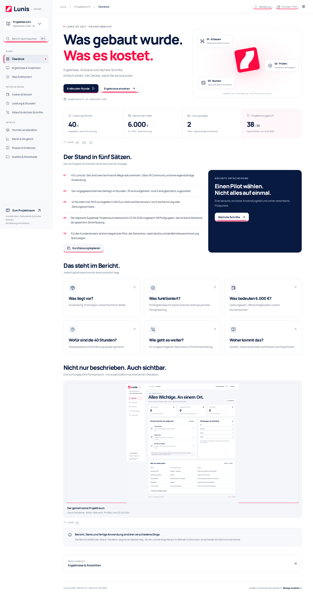
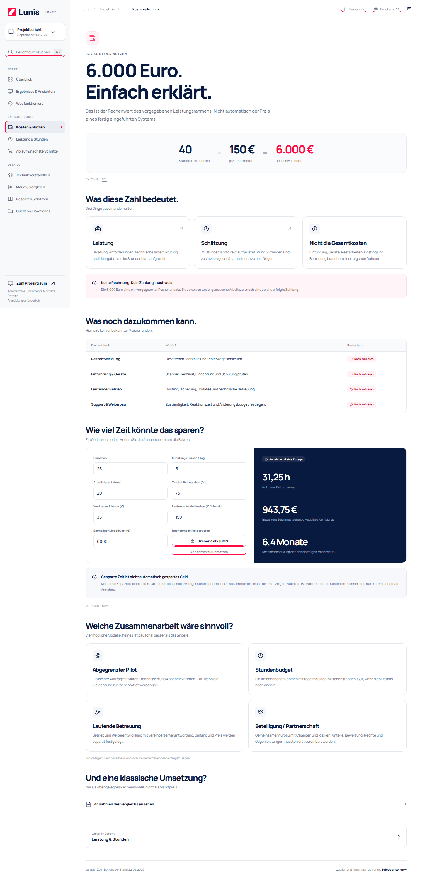
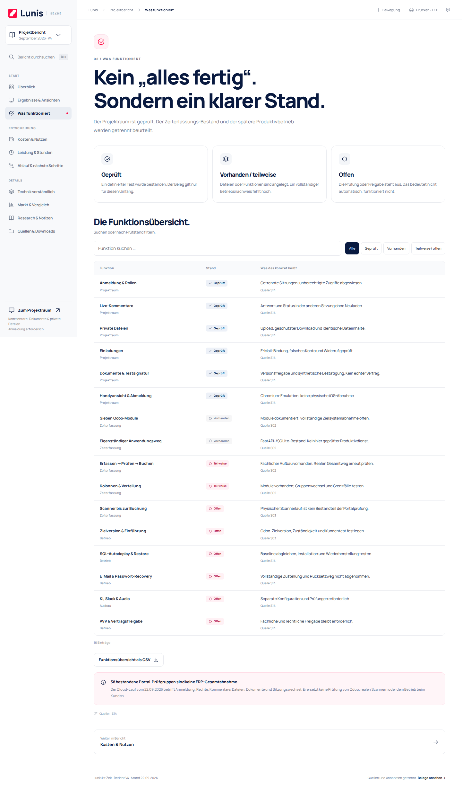

<!-- LUNIS_REPORT_V4_START -->
## Lunis Projektbericht V4 · V1 + V2 neu verbunden

**[Bericht öffnen](https://martin-hausleitner.github.io/lunis-status/experience/bericht/)** · [HTML-Paket](experience/bericht/exports/Lunis-Bericht-V4.zip) · [Quellen](experience/bericht/quellen.html) · [Quellcode](experience/report-src/)

Zehn echte Berichtsseiten, eine linke Kapitel-Navigation, einfachere Sprache, SVG-Icons, Kosten- und Nutzenmodell, filterbare Funktionsübersicht und eine fünfteilige Leserunde. Die früheren Fassungen und der bestehende Supabase-Projektraum bleiben erhalten.

| Kapitel | Inhalt |
|---|---|
| Überblick | Ergebnisse, 40 h Vorgabe und 6.000 € Rechenwert in fünf Sätzen |
| Ergebnisse & Ansichten | Historische geprüfte Portalbilder und ein neues synthetisches Bedienmodell |
| Was funktioniert | Geprüft, vorhanden und offen – ohne pauschale Fertigmeldung |
| Kosten & Nutzen | Rechnung 40 × 150 €, offene Folgekosten, veränderbare Modellannahmen |
| Leistung & Stunden | 35 gelistete Stunden und ca. 5 geschätzte Stunden getrennt |
| Ablauf & nächste Schritte | Quellenbasierter Arbeitsablauf und vorgeschlagener Pilot |
| Technik verständlich | Sieben Module; Fachablauf und Projektraum getrennt |
| Markt & Vergleich | Strukturzahlen, faire Fragen und Grenzen der Recherche |
| Research & Notizen | Methode und redigierte Gesprächszusammenfassungen |
| Quellen & Downloads | Quellenregister sowie HTML-, CSV-, JSON- und Text-Exporte |

### Neue Berichtsbilder

[Alle Berichtsbilder](proof/report-v4/) · [Browser-Prüfprotokoll](proof/report-v4/report-e2e.json)

Die Bilder oben wurden mit Chromium aus dem neuen Berichtsbuild aufgenommen. Der Browserlauf hat **24 Prüfgruppen bestanden**. Sie sind nicht mit den historischen Portal-Screenshots zu verwechseln. Die innerhalb des Berichts verwendeten Portalbilder stammen aus Cloud-Lauf `35720887432` und zeigen nur synthetische Testdaten.

Das eingebettete neue Zeitmodell bucht keine echte Zeit und ist nicht mit Odoo/Supabase verbunden. 6.000 € sind der Rechenwert des vorgegebenen Rahmens, keine Rechnung, Zahlung oder vollständiger Produktpreis. Der Bericht braucht offline keinen Server; Kommentare und private Dokumente bleiben im separaten angemeldeten Projektraum.
<!-- LUNIS_REPORT_V4_END -->

<!-- LUNIS_UI_CONTRACT_START -->
## Einheitliches Lunis UI

Statusseite, Supabase-Projektraum und Bericht V4 verwenden jetzt denselben Markenvertrag: **#fe0942 / #091a40**, dasselbe Flammenlogo und eine rote 2-px-Keyline an Buttons und Controls. Ein CI-Test verhindert neues Logo-/Farb-Drift.

[UI-Regeln](docs/UI-SYSTEM.md) · [Experience](experience/) · [Bericht V4](experience/bericht/)
<!-- LUNIS_UI_CONTRACT_END -->

# Lunis · Status und Projektraum

## Aktuelle Website

**[Lunis Projektraum öffnen](https://martin-hausleitner.github.io/lunis-status/experience/)**

Der Projektraum verwendet Supabase Auth, Postgres mit RLS, Realtime und privaten Storage. GitHub Pages liefert ausschließlich die Oberfläche aus. Benutzerkonten, Kommentare, Dokumente und Dateien liegen nicht im öffentlichen Repository.

## Verifizierter Stand · 22.09.2026

**38 Cloud-Prüfungen bestanden, 0 fehlgeschlagen.** Getestet wurde die tatsächliche öffentliche Website mit getrennten Browser-Sitzungen und synthetischen Supabase-Konten. Alle acht veröffentlichten Build-Dateien wurden zusätzlich bytegenau gegen Größen und SHA-256 aus `build.json` geprüft.

[Prüflauf 35720887432](https://github.com/Martin-Hausleitner/lunis-status/actions/runs/35720887432) · [13 echte Screenshots und JSON-Protokolle](https://github.com/Martin-Hausleitner/lunis-status/actions/runs/35720887432/artifacts/10691656355) · [Geprüftes Frontend-Paket](https://github.com/Martin-Hausleitner/lunis-status/actions/runs/35720887432/artifacts/10691451512)

| Bereich | Geprüft |
|---|---|
| Anmeldung und Rollen | Admin/Mitglied getrennt; falsches Passwort und unberechtigte Zugriffe abgewiesen |
| Kommentare | Realtime in beide Richtungen; Persistenz; vier parallele Wiederholungen erzeugen genau einen Eintrag |
| Einladungen | E-Mail-Bindung, Einmalverwendung, falsches Konto und widerrufener Link |
| Dokumente | Versteckte Entwürfe, versionierte Freigabe, synthetische Testsignatur, Ablehnung manipulierter Signaturen |
| Private Dateien | Authentifizierter Download mit Größen-/Hashprüfung; öffentliche Zugriffe und falsche Dateitypen abgewiesen |
| Sitzung | Private Dialoginhalte verschwinden nach Schließen; verspätete Downloadantwort nach Logout wird nicht ausgeliefert |
| Mobil/PWA | 390-Pixel-Chromium-Ansicht, reduzierte Bewegung, funktionierender Logout, Cache nur für die Anwendungshülle |
| Testbetrieb | Separate Cleanup-Stufe auch bei Runnerfehlern; keine verbleibenden CI-Konten oder CI-Workspaces |

Die Actions-Artefakte bleiben 14 Tage verfügbar. Das dauerhafte Prüfmanifest und die Backend-Migrationen stehen im [privaten Endbericht-Repository](https://github.com/servas-ai/lunis-endbericht/blob/main/experience/SUPABASE-READINESS.md). Keine pauschale Produktionsfreigabe: ursprüngliche SQL-Baseline/Autodeploy, SMTP/Recovery, Passwortrotation, Backup-Restore, reale Vertragstexte und physische Safari-/iOS-Prüfung bleiben gesonderte Freigaben. KI-/Slack-Anbindungen sind nicht als fertig ausgewiesen.

## Quellcode und Versionsarchiv

[Aktueller Frontend-Code](experience/) · [Build- und Cloud-Tests](experience/tests/) · [Vollständiger Versionsindex](https://github.com/servas-ai/lunis-endbericht/blob/main/versions/README.md)

Im privaten Versionsarchiv bleiben Endbericht V1 (9 Oberflächen), V2 (17), V3 (24) und die 11 früheren Experience-Clean-Prüfansichten unverändert erhalten. V1–V3 sind historische statische Render, keine nachträgliche Browserabnahme und keine produktiven Supabase-Apps. Die 13 neueren Browserbilder gehören zum oben verlinkten Readiness-Lauf.

## Weitere Seiten

`index.html` enthält den Evidenzbericht, `live.html` den früheren Live-Status und `berichte/` die ausgewählten Zwischenberichte. Vertrauliche Quelldaten werden hier nicht veröffentlicht. Die historische Statuskopie stammt vom 22.09.2026, 10:44 Uhr Europe/Vienna; daraus folgt keine Garantie einer laufenden Aktualisierung.

Keine Datenbankpasswörter, Auth-Sitzungen oder serverseitigen Secret Keys in Git. Die Cloud-Tests authentifizieren sich über kurzlebige, auf diesen Main-Workflow begrenzte GitHub-OIDC-Tokens.
